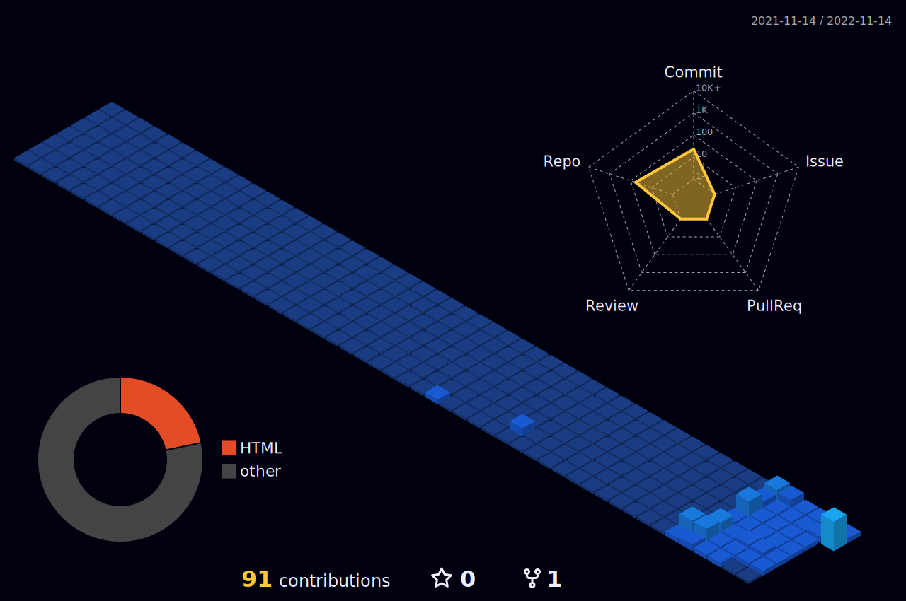

### <p align="center">Hey  I'm Habte Selassie </p>

<p align="center"> 
  <a href="https://github.com/habtuchelsea1000"></a>

</p>
 <p align="center">
  <a href="#"> <a/>
  <a href="#"><a/>
  <a href="#"><a/>	  
  <a href="#"><a/>
  <a href="#"><a/>
  <a href="#"><a/>
	  
</p>
	  


☞ 〔 ⚪️ 〕 Coding is fun

☞ 〔 🐵 〕 <a href="https://www.webilicious.in/"></a> <a href="https://www.srmist.edu.in"></a>

☞ 〔 🐼 〕Back End Developer

☞ 〔 🤾 〕21

☞ 〔  〕NodeJS

☞ 〔 👀 〕

<br>

### aboutMe.Js:

```javascript
const HabteSelassie = {
   pronouns: "he" | "him",
   code: [HTML,JS,CSS,C/C++,PYTHON,Java],
   askMeAbout: ["Front End Web Development","Back End Development","IOT","Machine Learning","Arteficial Intelegience",""],
   technologies: {
       frontEnd: [
           Js: {"VueJs", "ReactJs", "NextJs", "NuxtJs"}
       ],
       backEnd: [
           BasS: {"NodeJS","ExpressJS","MongoDB","PostgreSQL","MySql",""}
       ],
       competitive: [
           CompilerLang: {"C/C++"},
	   InterpretedLang: {"PYTHON"}
   ]
};
```


### Programing Languages:

   


<!-- <p align="right" width="50%"> <a href="#"></a></p>-->


### Front End:

    

<!--  -->

<!--  GIf -->
<a href="#"></a>


### Front End FrameWork:


<!--  -->


### Backend End:


 


### Tools:

 
 
 

 


### Personal Setup:


 


### Repositories:


### Clouds:
  
 
  
 
  
  

 ### Online Education Tools: 
 
 
 
 
 
 
	 

### Social Media:
 <p align="center">
  <a href="https://www.linkedin.com/in/habte-selassie-fitsum-yohnnesa-3b8883244/"><a/>
  <a href="https://github.com/habtuchelsea1000/habtuchelsea1000"><a/>
  <a href="https://twitter.com/habtuchelsea68"><a/>
  <a href="https://https://stackoverflow.com/users/20498861/habte-selassie-fitsum"><a/>
  <a href="mailto:habtuchelsea1000@gmail.com?subject=Github profile Visit"><a/>
</p>

### Habte Selassie.com speed:
   

### Github Stats:
 |  
:-------------------------:|:-------------------------:
 |  


### Github contribution:
	  
<h4 align="center">My contribution graph</h4>

<p align="center">  </p> 
<h4 align="center">Watch my contribution graph get eaten by the snake 🐍</h4>

<p align="center">  </p>
    
<h4 align="center">Isometric view of contributions in the last Months.</h4>	
	  
<p align="center">
	<a href="./profile-3d-contrib/profile-night-view.svg">
		
	</a>
</p>


